# Portfolio d'Interface - UniGames (Présentation Finale)

**Date :** 4 Juin 2026
**Client / Projet :** Plateforme de Gestion Sportive Universitaire "UniGames"

> [!IMPORTANT]
> Ce document présente l'interface finale de l'application web UniGames telle qu'elle a été développée et déployée. Les captures ci-dessous reflètent le fonctionnement réel, le rendu responsif (TailwindCSS) et le thème sombre professionnel implémenté.

---

## 1. Vue d'Ensemble & Tableau de Bord

Cette section présente l'entrée dans l'application, incluant la page de connexion sécurisée et le tableau de bord (Dashboard) compilant les statistiques globales de l'édition en cours.

````carousel
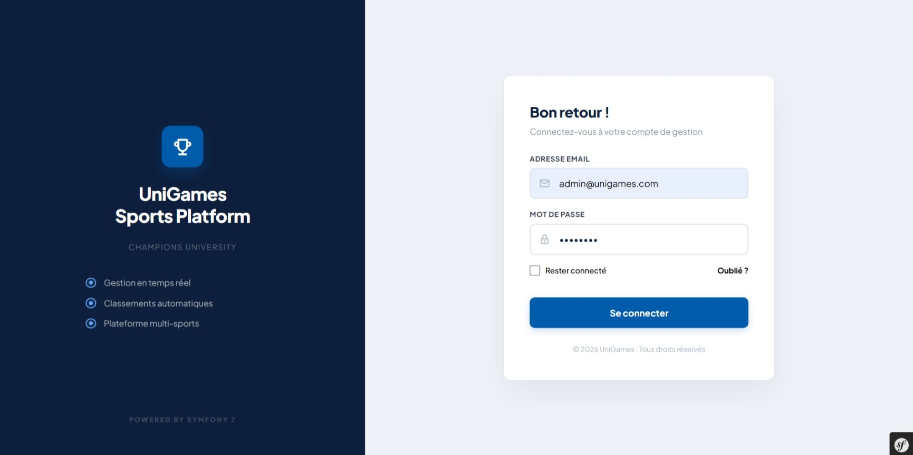
<!-- slide -->
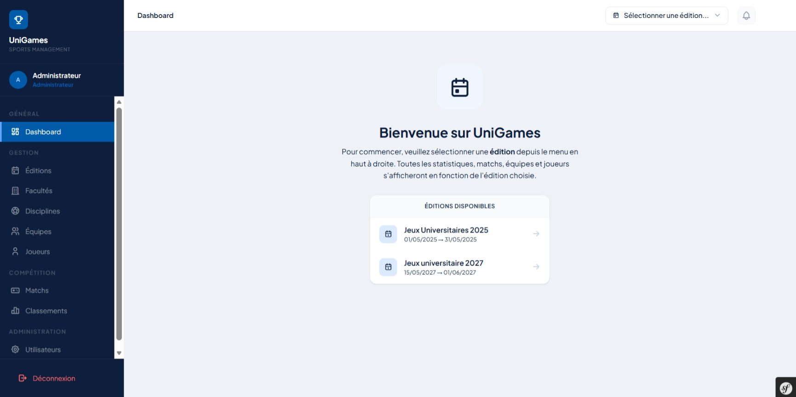
<!-- slide -->
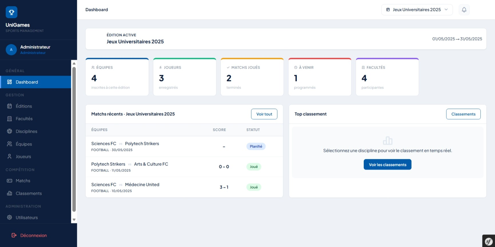
<!-- slide -->
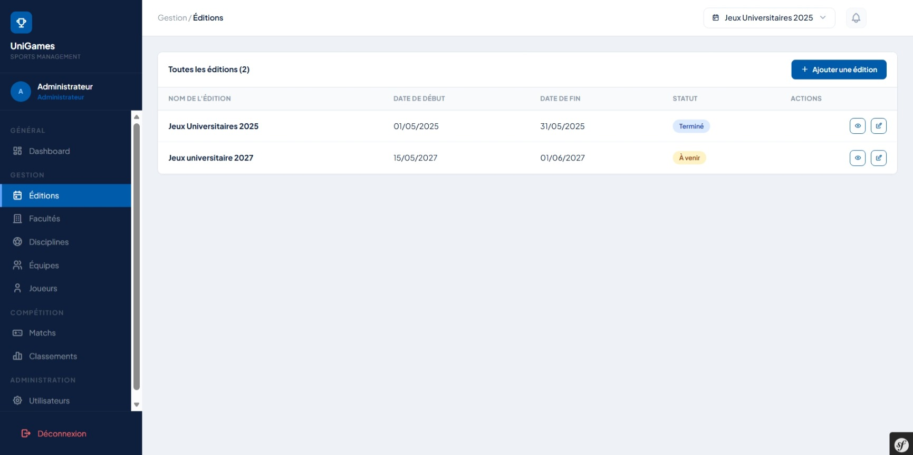
````

> [!TIP]
> **Expérience Utilisateur (UX) :** Le design utilise le style *Glassmorphism* et un thème sombre profond (`#0D1F3C`) avec des accents bleus (`#005BAA`) pour donner un aspect "Premium" et sportif.

---

## 2. Administration et Gestion des Entités

L'administration au jour le jour permet de configurer les éditions, disciplines, facultés et d'inscrire les équipes et joueurs. Le sélecteur global (en haut à droite) permet de filtrer ces vues contextuellement.

````carousel
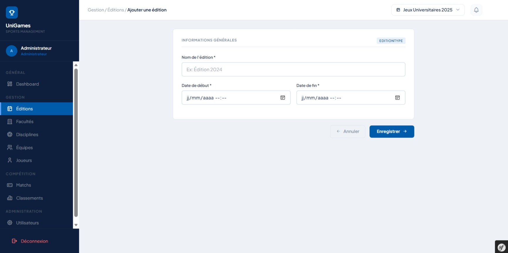
<!-- slide -->
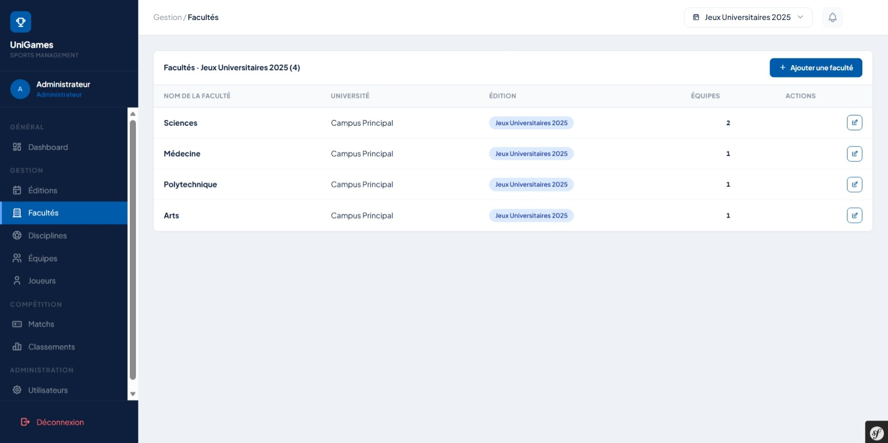
<!-- slide -->
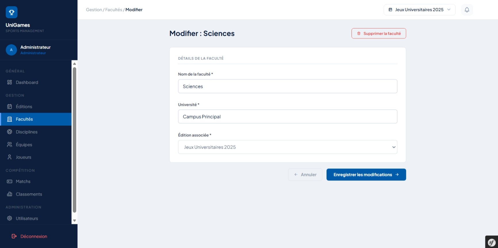
<!-- slide -->
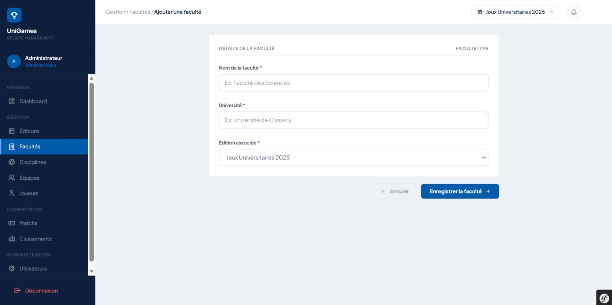
<!-- slide -->
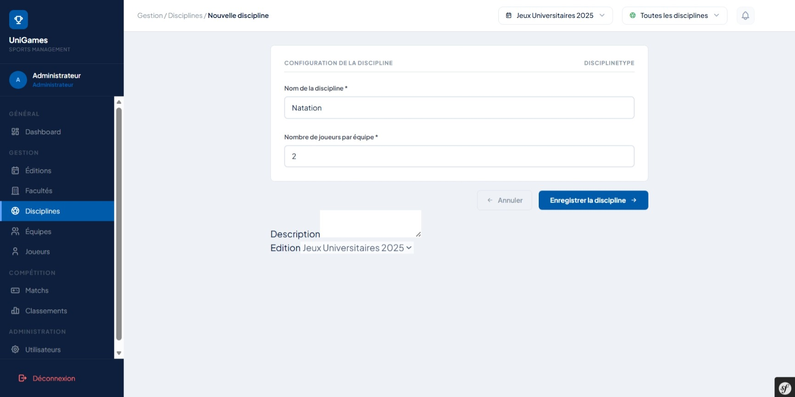
<!-- slide -->
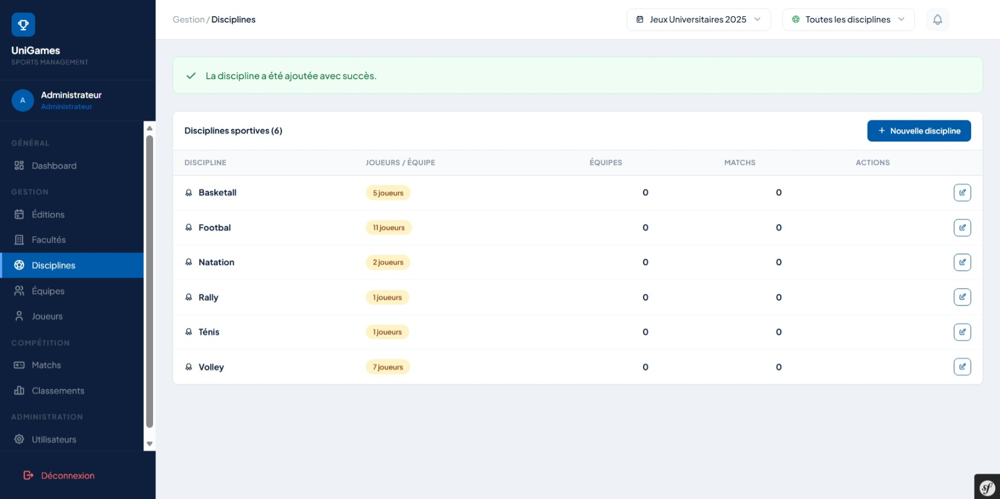
````

> [!NOTE]
> Tous les tableaux de données sont interactifs et bénéficient d'une pagination native pour supporter un grand nombre d'enregistrements (ex: des centaines de joueurs).

---

## 3. Module Compétition (Matchs & Classements)

Le cœur de l'application : l'organisation des matchs, la saisie des scores en direct et la consultation des classements dynamiques.

````carousel
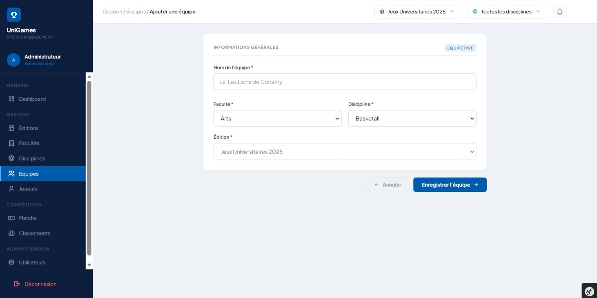
<!-- slide -->
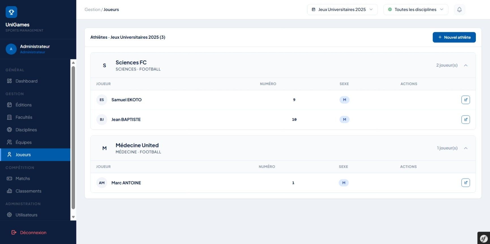
<!-- slide -->
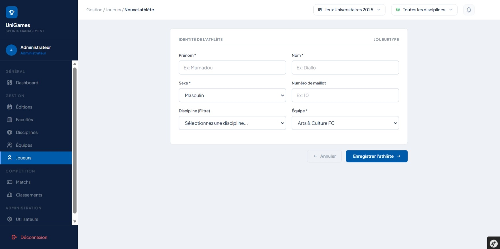
<!-- slide -->
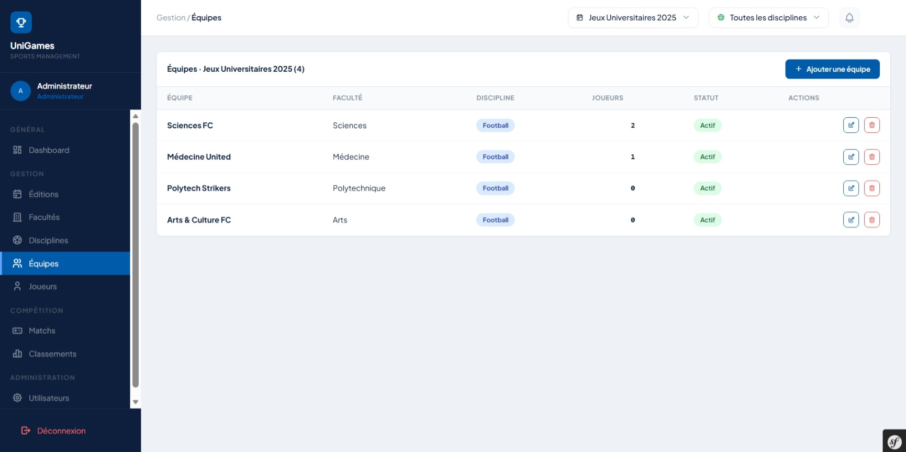
<!-- slide -->
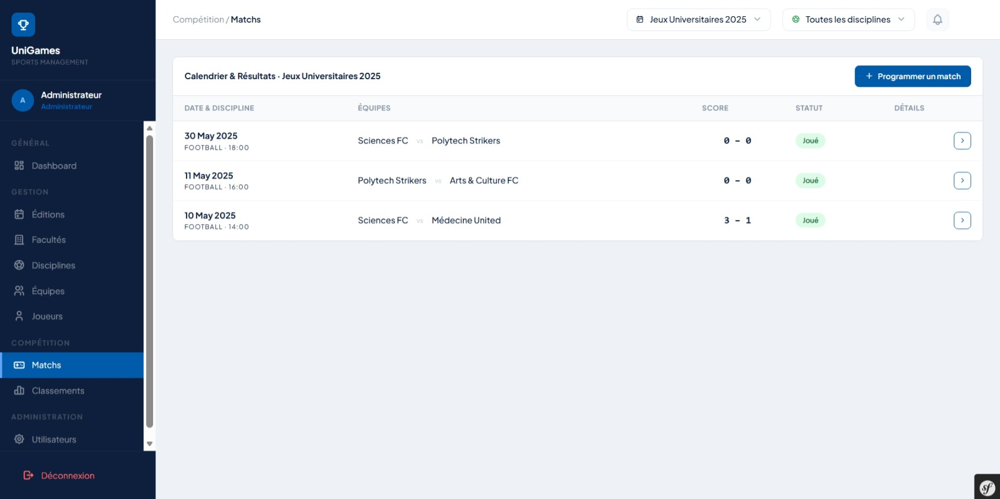
<!-- slide -->
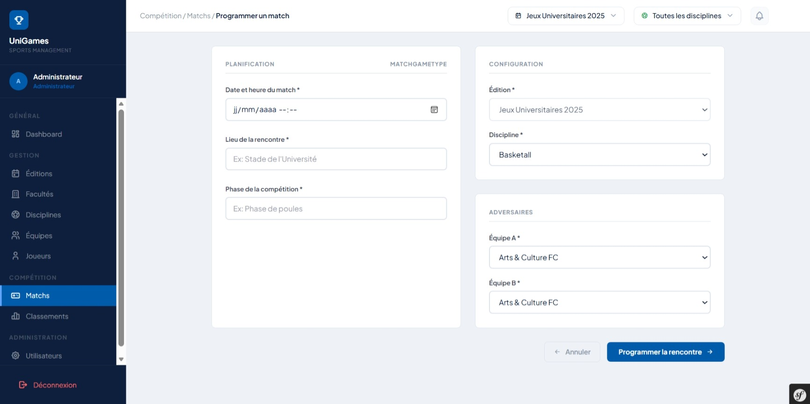
<!-- slide -->
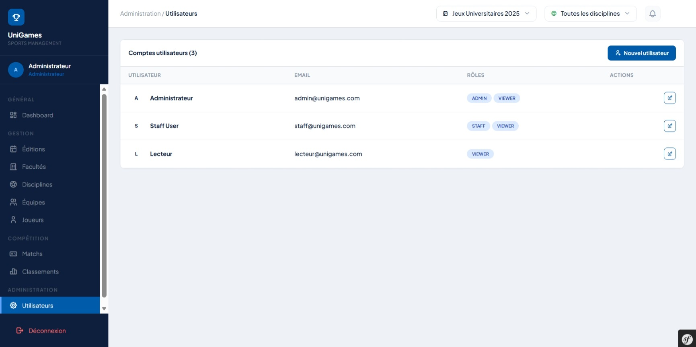
<!-- slide -->
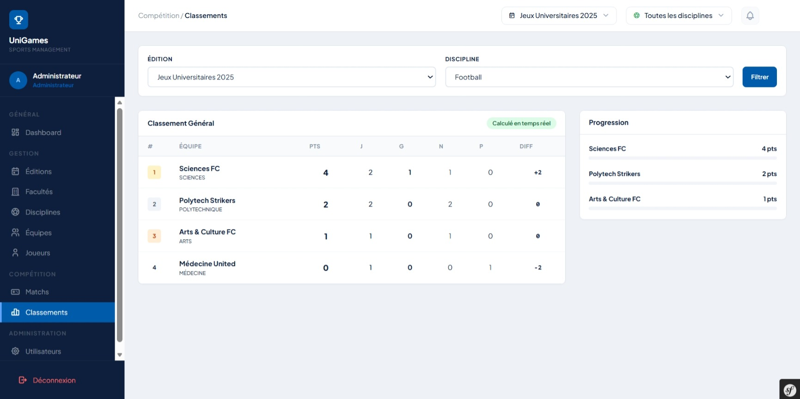
````

> [!IMPORTANT]
> **Calcul Automatique :** Le système de classement illustré dans les captures ci-dessus ne stocke rien en base. Il calcule les points, différences de buts et statistiques à la volée en se basant sur les matchs au statut "Joué" appartenant à l'Édition sélectionnée !
