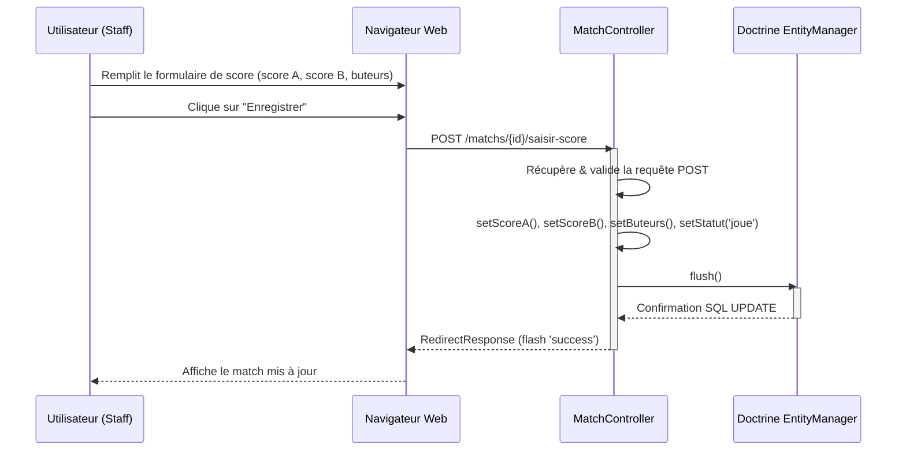
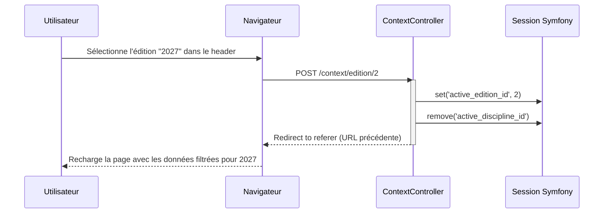
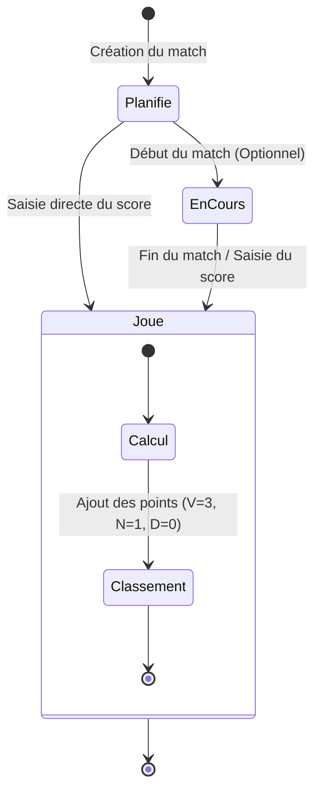
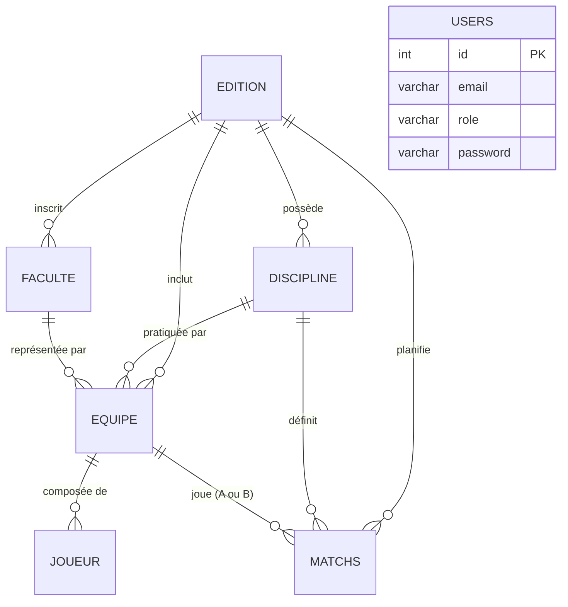

# Diagrammes UML - UniGames

**Date :** 3 Juin 2026
**Projet :** UniGames

Ce document présente les diagrammes modélisant l'architecture et les processus de la plateforme UniGames.

## 1. Diagramme de Classes

Ce diagramme illustre les entités du projet et leurs relations (généré à partir de l'architecture réelle).


## 2. Diagramme de Cas d'Utilisation

Ce diagramme présente les interactions possibles entre les acteurs et le système.

```mermaid
usecaseDiagram
    actor Viewer as "Lecteur (Public)"
    actor Staff as "Staff Sportif"
    actor Admin as "Administrateur"

    usecase UC1 as "Consulter tableau de bord"
    usecase UC2 as "Consulter les matchs"
    usecase UC3 as "Consulter les classements"
    
    usecase UC4 as "Gérer les équipes"
    usecase UC5 as "Gérer les joueurs"
    usecase UC6 as "Programmer des matchs"
    usecase UC7 as "Saisir les scores et buteurs"
    
    usecase UC8 as "Gérer les éditions"
    usecase UC9 as "Gérer les disciplines"
    usecase UC10 as "Gérer les facultés"
    usecase UC11 as "Gérer les utilisateurs"

    Viewer --> UC1
    Viewer --> UC2
    Viewer --> UC3

    Staff --> UC1
    Staff --> UC2
    Staff --> UC3
    Staff --> UC4
    Staff --> UC5
    Staff --> UC6
    Staff --> UC7

    Admin --> UC1
    Admin --> UC2
    Admin --> UC3
    Admin --> UC4
    Admin --> UC5
    Admin --> UC6
    Admin --> UC7
    Admin --> UC8
    Admin --> UC9
    Admin --> UC10
    Admin --> UC11
```

## 3. Diagramme de Séquence : Saisie de Score

Ce diagramme montre le processus de sauvegarde d'un résultat de match.



## 4. Diagramme de Séquence : Changement de Contexte (Édition)

Ce diagramme explique comment le système filtre globalement l'application.



## 5. Diagramme d'Activité : Processus de Match

Ce diagramme détaille le cycle de vie d'un match.



## 6. Modèle Logique de Données (MLD)


