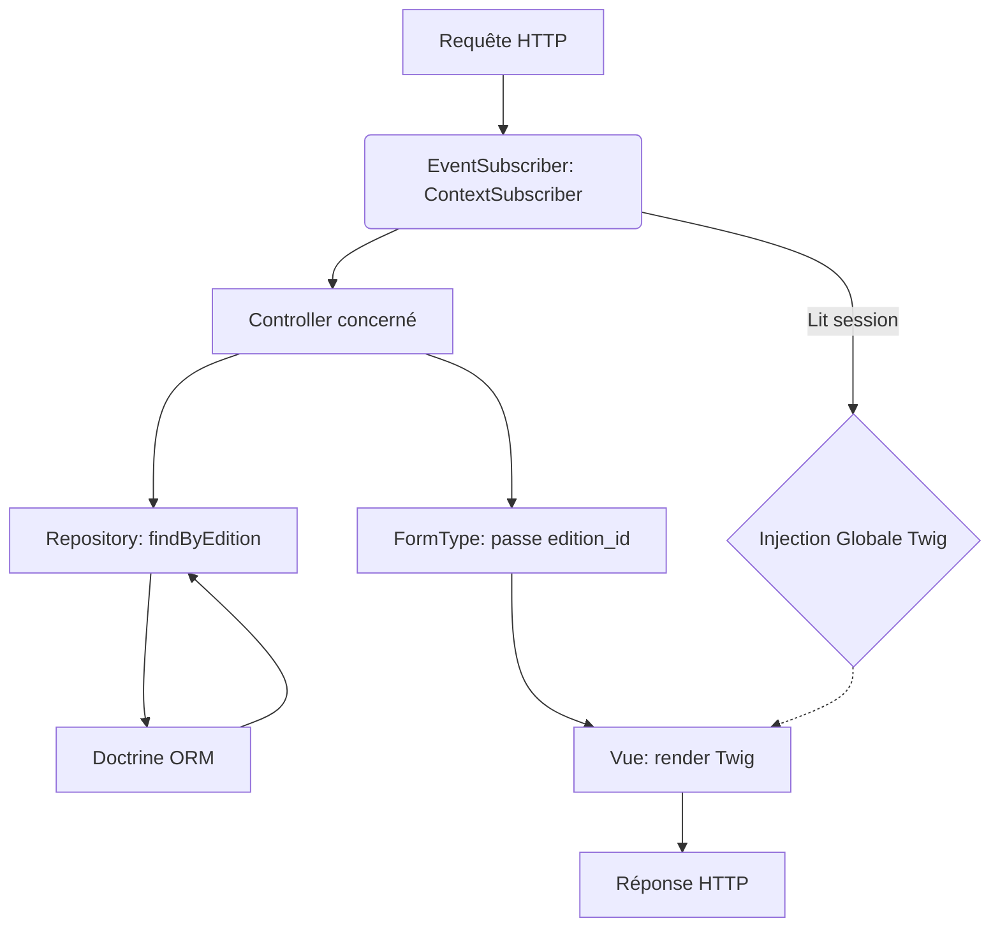

# Documentation Technique du Projet - UniGames

**Date :** 3 Juin 2026
**Projet :** UniGames

Ce document de référence est destiné aux développeurs Symfony rejoignant le projet. Il détaille l'architecture interne, les patterns de conception et le flux des données.

## 1. Vue d'Ensemble de l'Architecture

UniGames respecte strictement les standards de **Symfony 7** avec Doctrine ORM. Le cœur de l'application repose sur le concept de **contexte spatial et temporel actif**. L'utilisateur navigue toujours au sein d'une Édition active et optionnellement d'une Discipline active.

### 1.1 Diagramme d'Architecture (Flux de Requête)



## 2. Détail des Couches Applicatives

### 2.1 Couche Modèle (Entities & Repositories)
**7 Entités** modélisent le domaine métier.
- L'entité centrale est `Edition`.
- `Discipline`, `Faculte`, `Equipe`, `MatchGame` ont toutes une relation `ManyToOne` vers `Edition`.
- **7 Repositories** étendent `ServiceEntityRepository`. Ils implémentent des méthodes métier spécifiques telles que `$repository->findByEdition($id)` ou `$repository->countByEdition($editionId, $disciplineId)`.

### 2.2 Couche Contrôleurs (11 Controllers)
- **AbstractController** : Tous étendent ce composant Symfony.
- **Routage** : Déclaratif via les attributs PHP 8 `#[Route]`.
- **Sécurisation** : Déclarative via `#[IsGranted('ROLE_...')]`.
- **Exemple notable (`MatchController::score`)** :
  Le traitement du score contourne volontairement les formulaires Symfony pour lire directement les variables `$request->request->all()`, permettant un traitement dynamique du JSON complexe pour les buteurs.

### 2.3 Couche Formulaires (FormTypes)
- Chaque formulaire (ex: `JoueurType`) possède un validateur et une configuration.
- **Context-Aware Forms :** La méthode `configureOptions` définit `edition_id => null`. Ce paramètre est utilisé dans `buildForm` pour filtrer dynamiquement les requêtes des champs de type `EntityType` via un `query_builder`.

### 2.4 Couche Vue (Twig)
- L'héritage est utilisé : tout étend `base.html.twig`.
- La navbar reçoit les variables `all_editions`, `all_disciplines`, `active_edition`, et `active_discipline` sans effort supplémentaire des contrôleurs individuels, grâce au `ContextSubscriber`.

## 3. Logiques Métier Spécifiques

### 3.1 Moteur de Classement (`ClassementController`)
L'algorithme de classement ne s'appuie pas sur un stockage persistant mais sur un **calcul à la volée** très rapide.
1. Parcours de toutes les équipes d'une discipline/édition.
2. Itération sur les matchs (`$equipe->getAllMatchs()`).
3. Filtre : Seuls les matchs avec `statut === 'joue'` sont traités.
4. Attribution des variables : V, N, D, BP, BC.
5. Tri PHP (`usort`) appliquant les règles sportives :
   ```php
   usort($classement, function ($a, $b) {
       if ($a['points'] !== $b['points']) return $b['points'] <=> $a['points'];
       if ($a['difference'] !== $b['difference']) return $b['difference'] <=> $a['difference'];
       return $b['buts_pour'] <=> $a['buts_pour'];
   });
   ```

### 3.2 Gestion Robuste du JSON (Buteurs)
Le stockage MySQL JSON peut parfois souffrir de double-encodage si mal parsé par le front-end.
L'entité `MatchGame` implémente `getDecodedButeurs()` qui vérifie le type de donnée retourné par Doctrine et applique un décodage itératif de sécurité pour s'assurer de toujours retourner une structure PHP `['equipe_a' => [], 'equipe_b' => []]`.

## 4. Sécurité
- **Authentification :** Authentification par formulaire native de Symfony (`form_login`). L'entité `User` implémente `UserInterface`.
- **Autorisation (CSRF) :** Le Token CSRF est exigé pour chaque requête `POST` supprimant une entité (via `$this->isCsrfTokenValid()`).

## 5. API Interne et Routes Clés

| Route (URL) | Nom | Contrôleur cible | Rôle |
|-------------|-----|------------------|------|
| `/` | `app_dashboard` | `DashboardController::index` | Vue générale (Stats) |
| `/context/edition/{id}` | `app_context_edition` | `ContextController::setEdition` | Modifie la session |
| `/matchs/{id}/saisir-score` | `app_match_score` | `MatchController::saisirScore` | Mise à jour classement |

## 6. Conventions de Code
- Normes **PSR-12**.
- Nommage des vues : `dossier_entite/nom_action.html.twig` (ex: `equipe/new.html.twig`).
- Typage strict activé (`declare(strict_types=1);` recommandé sur les nouveaux fichiers).
- Privilégier les closures de requête (QueryBuilders) dans les Repository plutôt que directement dans les contrôleurs.
